# Sentiment Analysis and Text Classification using Fuzzy Logic and NLP

A sophisticated web application that leverages fuzzy logic principles and natural language processing techniques to analyze and classify the sentiment of text with more nuanced results than traditional binary classification systems.


## Table of Contents
- [Project Overview](#project-overview)
- [System Architecture](#system-architecture)
- [Features](#features)
- [Fuzzy Logic Approach](#fuzzy-logic-approach)
- [Visualizations](#visualizations)
- [Installation](#installation)
- [Usage](#usage)
- [Technologies Used](#technologies-used)
- [Future Improvements](#future-improvements)

## Project Overview

This project implements a sentiment analysis system using fuzzy logic to provide a more nuanced understanding of sentiment in text. Unlike traditional binary classification (positive/negative), this approach uses fuzzy set theory to express sentiment on a continuous spectrum with varying degrees of membership in different sentiment categories.

The system classifies text into seven sentiment categories:
- Very Negative
- Negative
- Slightly Negative
- Neutral
- Slightly Positive
- Positive
- Very Positive

## System Architecture

The application follows a client-server architecture:

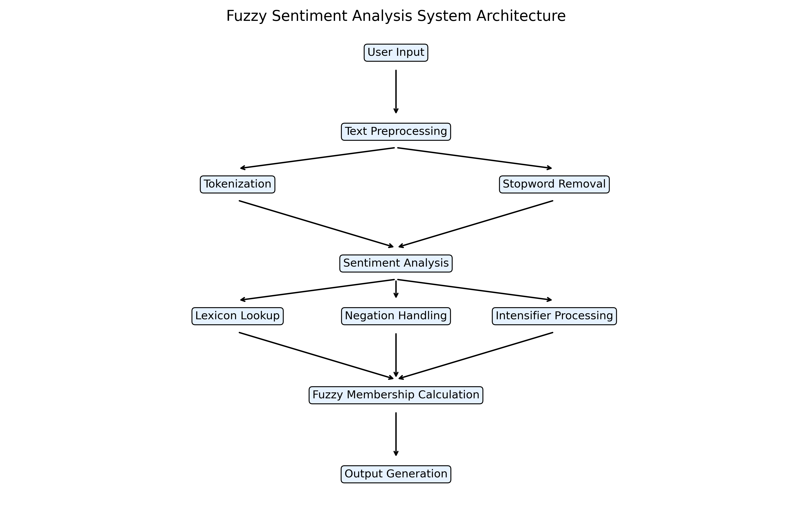

- **Frontend**: A responsive web interface built with HTML, CSS (Bootstrap), and JavaScript
- **Backend**: Flask server that handles requests and processes text
- **NLP Processing**: NLTK library for text preprocessing
- **Fuzzy Logic Engine**: scikit-fuzzy for implementing fuzzy membership functions and sentiment classification

## Features

- **Text Analysis**: Analyze any text input for sentiment
- **Membership Visualization**: See the degree of membership in negative, neutral, and positive sentiment categories
- **Predefined Examples**: Try out the system with sample sentences
- **Nuanced Classifications**: Get more detailed sentiment classifications beyond simple positive/negative
- **Context-Aware Analysis**: Handles negations and intensifiers in text
- **Real-time Processing**: Instant analysis and visualization

## Fuzzy Logic Approach

The system uses the following fuzzy logic components:

### Membership Functions

The sentiment is analyzed using three overlapping membership functions:

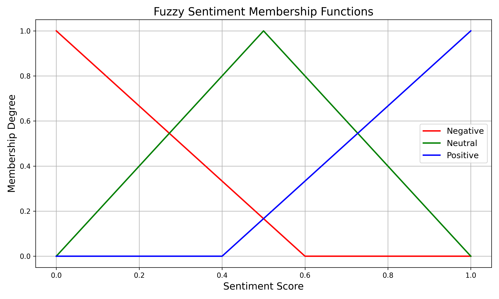

### Fuzzy Categories

The final sentiment score is mapped to fuzzy categories for interpretation:

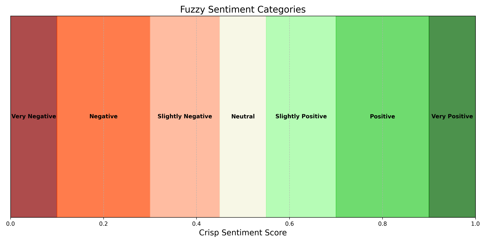

### Sentiment Lexicon

A comprehensive sentiment lexicon assigns fuzzy membership values to words across the sentiment spectrum:

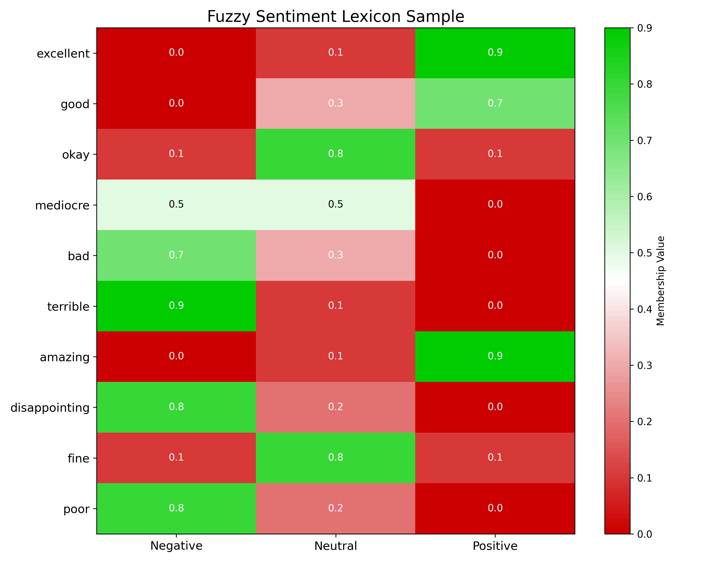

### Special Language Handling

The system handles special language constructs:

1. **Negation Effects**: Words like "not", "don't", etc. invert sentiment
   
   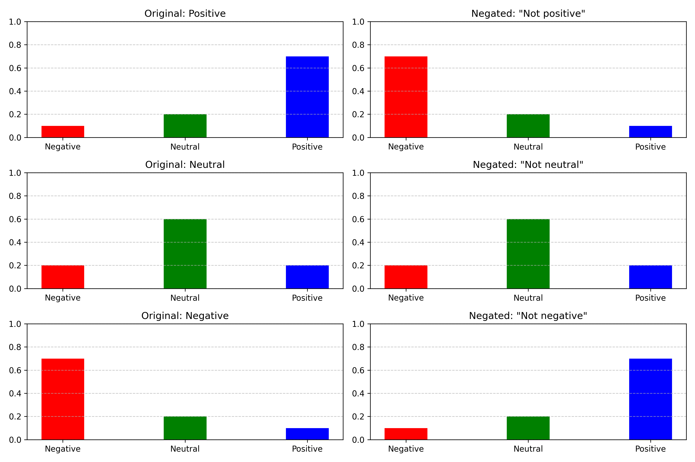

2. **Intensifier Effects**: Words like "very", "extremely", etc. amplify sentiment
   
   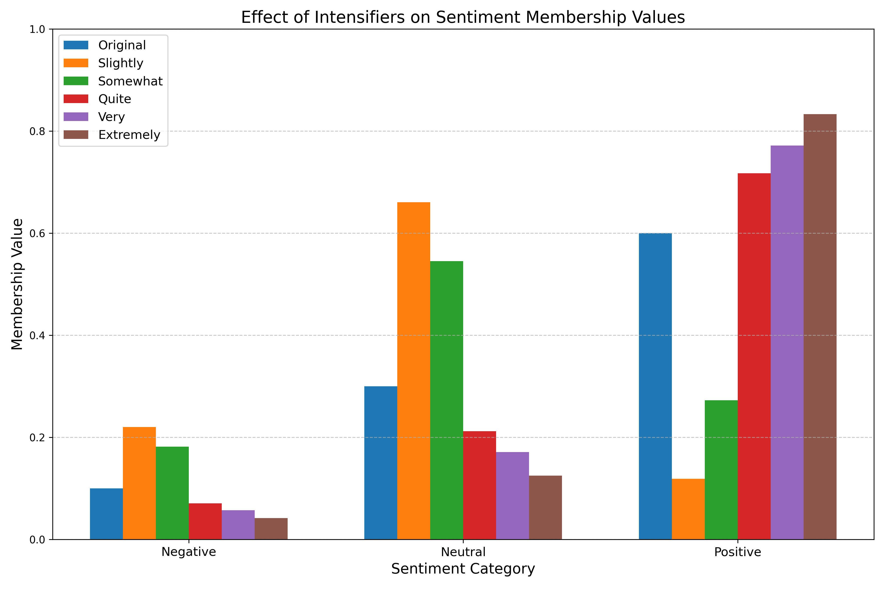

## Visualizations

### Sample Analysis Examples

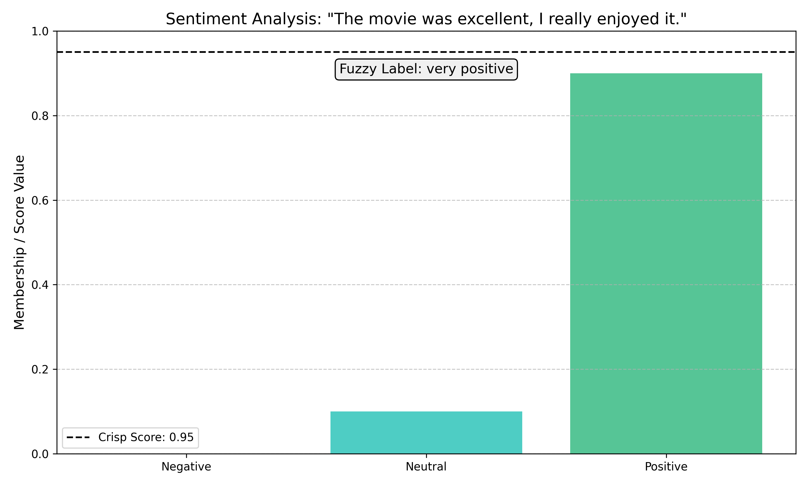
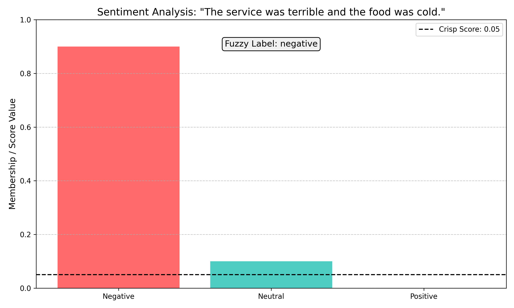
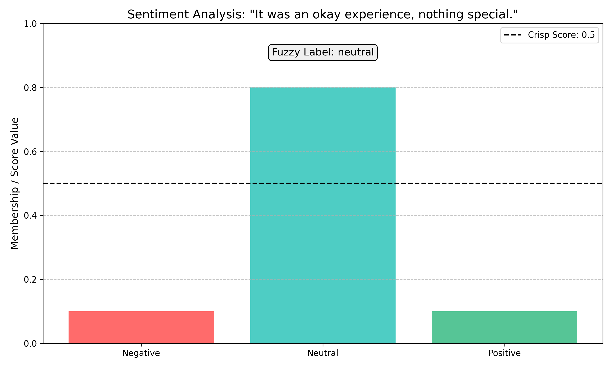
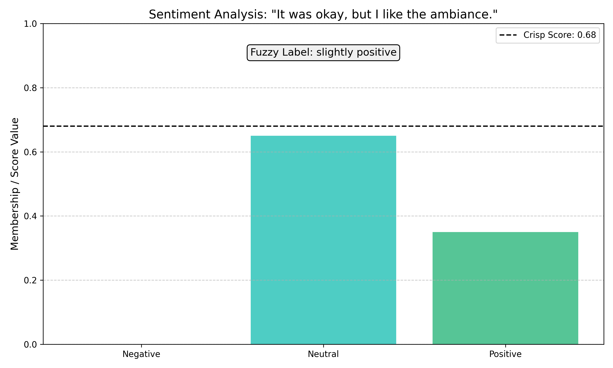

### Sentiment Comparison

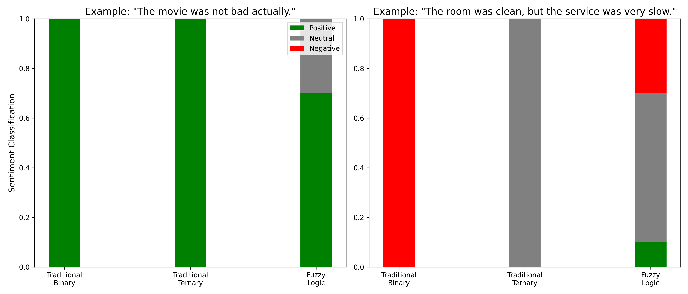

## Installation

1. Clone the repository:
   ```
   git clone https://github.com/yourusername/Sentiment-Analysis-and-Text-Classification-using-Fuzzy-Logic-and-NLP.git
   cd Sentiment-Analysis-and-Text-Classification-using-Fuzzy-Logic-and-NLP-main
   ```

2. Create a virtual environment and activate it:
   ```
   python -m venv venv
   # On Windows
   venv\Scripts\activate
   # On macOS/Linux
   source venv/bin/activate
   ```

3. Install the required packages:
   ```
   pip install -r requirements.txt
   ```

4. Download required NLTK resources:
   ```
   python nltk_downloader.py
   ```

## Usage

1. Start the Flask server:
   ```
   python app.py
   ```

2. Open your web browser and navigate to:
   ```
   http://localhost:5000
   ```

3. Enter text in the input field and click "Analyze Sentiment" to see the results.

4. Alternatively, browse the "Examples" tab to try pre-defined examples.

## Technologies Used

- **Python**: Primary programming language
- **Flask**: Web server framework
- **NLTK**: Natural Language Processing toolkit
- **scikit-fuzzy**: Fuzzy logic implementation
- **NumPy**: Numerical computations
- **HTML/CSS/JavaScript**: Frontend web interface
- **Bootstrap**: Responsive UI components

## Future Improvements

- Add support for more languages
- Integrate with social media APIs for real-time sentiment analysis
- Enhance the sentiment lexicon with domain-specific terms
- Implement machine learning to improve sentiment detection accuracy
- Add user authentication for saving sentiment analysis history
- Extend the system to analyze longer documents and provide segment-by-segment analysis 